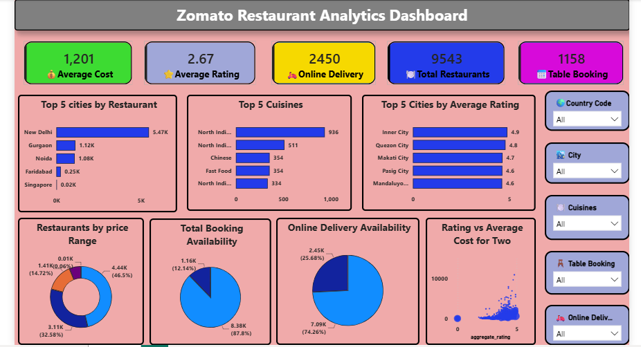

# 🍽️ Zomato Restaurant Data Analysis

A complete Data Analysis project on the Zomato Restaurant Dataset using **Python, Pandas, Matplotlib, Seaborn, and Power BI**. This project explores restaurant trends, customer preferences, pricing, ratings, online delivery, and geographic insights through data cleaning, analysis, and interactive dashboards.

---

## 📌 Project Overview

This project was completed as part of the **Cognifyz Technologies Data Analysis Internship**. It focuses on analyzing restaurant data to uncover valuable business insights and visualize them using Power BI.

---

## 🚀 Objectives

- Clean and preprocess restaurant data
- Perform Exploratory Data Analysis (EDA)
- Analyze cuisines, ratings, cities, and price ranges
- Study online delivery and table booking services
- Build an interactive Power BI dashboard
- Generate business insights for decision-making

---

## 🛠️ Technologies Used

- Python
- Pandas
- NumPy
- Matplotlib
- Seaborn
- Power BI
- Jupyter Notebook

---

## 📂 Project Structure

```
📁 Zomato-Restaurant-Analysis
│
├── 📄 Zomato_Restaurant_dataset.ipynb
├── 📄 Zomato_Restaurant_clean_data.csv
├── 📄 Zomato_Restaurants Dashboard.pbix
├── 📁 images
│   ├── Dashboard.png
│   ├── Rating_Distribution.png
│   ├── Price_Range.png
│   └── Online_Delivery.png
├── 📄 README.md
```

---

## 📊 Dashboard Features

- ⭐ Total Restaurants
- ⭐ Average Rating
- ⭐ Average Cost
- ⭐ Total Votes
- 🍽️ Top Cuisines
- 🌍 City-wise Restaurant Analysis
- 💰 Price Range Distribution
- 🚚 Online Delivery Analysis
- 📈 Rating Distribution
- 📍 Interactive Filters (Slicers)

---

## 📈 Exploratory Data Analysis

The project includes analysis of:

- Top 3 Most Common Cuisines
- Restaurant Distribution by City
- Average Rating by City
- Price Range Distribution
- Online Delivery Percentage
- Rating Distribution
- Restaurant Votes Analysis
- Cuisine Combination Analysis
- Restaurant Chains
- Geographic Distribution

---

## 📊 Dashboard



---

## 💡 Key Insights

- Identified the most popular cuisines.
- Found cities with the highest number of restaurants.
- Compared restaurant ratings across cities.
- Analyzed the relationship between ratings and online delivery.
- Explored customer voting patterns.
- Studied restaurant price range distribution.

---

## 📥 Dataset

The dataset contains information such as:

- Restaurant Name
- City
- Cuisines
- Aggregate Rating
- Votes
- Price Range
- Online Delivery
- Table Booking
- Longitude & Latitude

---

## ▶️ How to Run

### Clone Repository

```bash
git clone https://github.com/your-username/Zomato-Restaurant-Analysis.git
```

### Install Libraries

```bash
pip install pandas numpy matplotlib seaborn
```

### Run

Open

```
Zomato_Restaurant_dataset.ipynb
```

using Jupyter Notebook and execute all cells.

---

## 📌 Future Improvements

- Build Machine Learning models
- Restaurant Recommendation System
- Interactive Streamlit Dashboard
- Real-time Data Integration

---

## 🙋 Author

**Raman Kushwaha**

🎓 MCA Graduate

💼 Aspiring Data Analyst

### Skills

- Python
- SQL
- Power BI
- Excel
- Data Analysis
- Data Visualization

---

## ⭐ If you like this project

Give this repository a ⭐ Star and feel free to fork it.
